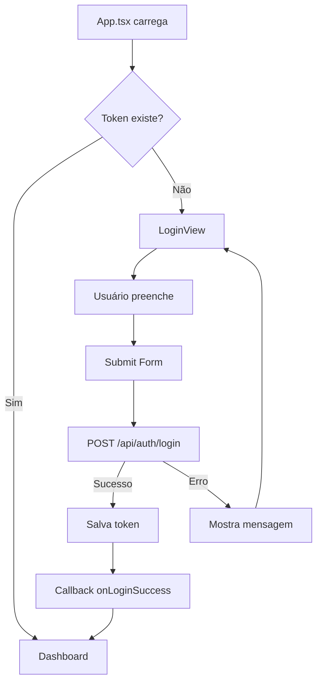

# 🔐 Implementação da Tela de Login - AutonomyX

## 📋 Visão Geral

Foi implementada uma tela de login moderna e profissional seguindo o design system AutonomyX com:
- ✅ Design glassmorphism com blur effects
- ✅ Gradientes ciano (#00BFFF) + magenta (#FF00CC)
- ✅ Animações suaves e profissionais
- ✅ Opção "Lembrar-me" para salvar credenciais
- ✅ Validação de campos
- ✅ Integração com API REST
- ✅ Feedback visual de erros
- ✅ Loading state durante autenticação
- ⚡ **LOGIN ADMIN** - Bypass para desenvolvimento (sem API)

## 🎨 Componentes Criados

### 1. LoginView.tsx
Componente principal da tela de login localizado em `/components/LoginView.tsx`

**Props:**
```typescript
interface LoginViewProps {
  onLoginSuccess: (token: string, userData: any) => void;
}
```

**Recursos:**
- Campo "Nome da Revenda" (username)
- Campo "Senha da Revenda" (password)
- Toggle de visibilidade de senha
- Checkbox "Lembrar meu login"
- Link "Esqueceu sua senha?"
- Loading spinner durante autenticação
- Mensagens de erro contextuais

## 🔌 Integração com API

### Endpoint Padrão
```
POST https://automatixbest-api.automation.app.br/api/auth/login
```

### Request Body
```json
{
  "username": "nome_revenda",
  "password": "senha_revenda"
}
```

### Response Esperada
```json
{
  "access_token": "eyJhbGciOiJIUzI1NiIsInR5cCI6IkpXVCJ9...",
  "token_type": "Bearer",
  "expires_in": 3600,
  "user": {
    "id": 1,
    "username": "nome_revenda",
    "email": "email@exemplo.com"
  }
}
```

**Nota:** O código aceita diferentes formatos de resposta:
- `data.access_token`
- `data.token`
- `data.result.token`

## 💾 Armazenamento Local

### Tokens e Credenciais
```javascript
// Token de autenticação
localStorage.setItem('auth_token', token);

// Credenciais salvas (se "Lembrar-me" estiver marcado)
localStorage.setItem('saved_username', nomeRevenda);
localStorage.setItem('remember_me', 'true');
```

### Verificação de Autenticação
```javascript
const token = localStorage.getItem('auth_token');
if (token) {
  // Usuário autenticado
}
```

## 🔄 Fluxo de Autenticação



## 🛠️ Modificações no App.tsx

### 1. Novos States
```typescript
const [isAuthenticated, setIsAuthenticated] = useState(false);
const [userData, setUserData] = useState<any>(null);
```

### 2. UseEffect de Verificação
```typescript
useEffect(() => {
  const token = localStorage.getItem('auth_token');
  if (token) {
    setIsAuthenticated(true);
  }
}, []);
```

### 3. Handlers
```typescript
const handleLoginSuccess = (token: string, user: any) => {
  setIsAuthenticated(true);
  setUserData(user);
};

const handleLogout = () => {
  localStorage.removeItem('auth_token');
  setIsAuthenticated(false);
  setUserData(null);
  setDashboardData(null);
};
```

### 4. Renderização Condicional
```typescript
if (!isAuthenticated) {
  return <LoginView onLoginSuccess={handleLoginSuccess} />;
}
```

## 🎯 Como Usar

### 🔥 Login Admin (Desenvolvimento)
**NOVO! Acesso Rápido sem API**

**Opção 1 - Botão de Acesso Admin:**
1. Clique no botão **"Acesso Admin"** com badge dourado "DEV"
2. Entra automaticamente no dashboard
3. Não precisa de API ou credenciais

**Opção 2 - Credenciais Manuais:**
1. Digite:
   - **Nome da Revenda:** `admin`
   - **Senha:** `admin123`
2. Clique em "Entrar no Dashboard"
3. Sistema detecta credenciais admin e faz bypass da API

**Características do Login Admin:**
- ⚡ **Instantâneo** - Sem chamadas à API
- 🔓 **Sem autenticação** - Perfeito para desenvolvimento
- 💾 **Salva token mock** no localStorage
- 🎭 **Usuário fake** com role "admin"

### 1. Primeiro Acesso (Produção)
1. Usuário acessa a aplicação
2. Vê a tela de login automaticamente
3. Preenche "Nome da Revenda" e "Senha"
4. (Opcional) Marca "Lembrar meu login"
5. Clica em "Entrar no Dashboard"
6. Sistema faz autenticação na API
7. Se sucesso → Redireciona para dashboard
8. Se erro → Mostra mensagem de erro

### 2. Acessos Subsequentes
- Se "Lembrar-me" foi marcado: campo username vem preenchido
- Se token ainda é válido: entra direto no dashboard
- Se token expirou: retorna para login

### 3. Logout
- Botão "Sair" no canto superior direito do header
- Remove token e dados da sessão
- Retorna para tela de login

## 🔧 Customização da API

### Alterar Endpoint
Edite em `/components/LoginView.tsx`:
```typescript
const response = await fetch('SUA_URL_AQUI/api/auth/login', {
  // ...
});
```

### Alterar Campos do Request
Se sua API usa campos diferentes:
```typescript
body: JSON.stringify({
  email: nomeRevenda,  // ao invés de username
  password: senhaRevenda,
}),
```

### Alterar Extração do Token
Se sua API retorna token em formato diferente:
```typescript
const token = data.seu_campo_token || data.outro_campo;
```

## 🎨 Design System

### Cores Principais
```css
--ciano-primary: #00BFFF
--magenta-primary: #FF00CC
--background: #0B0F18
--card-bg: rgba(17, 24, 39, 0.7)
--text-primary: #EAF2FF
--text-secondary: #7A8AAE
--error: #FF4A9A
--success: #22E3AF
```

### Gradientes
```css
/* Logo */
background: linear-gradient(135deg, #00bfff 0%, #ff00cc 100%);

/* Botão */
background: linear-gradient(135deg, #00bfff 0%, #0083ff 50%, #ff00cc 100%);

/* Efeitos de fundo */
radial-gradient(circle, rgba(0, 191, 255, 0.08) 0%, transparent 50%)
radial-gradient(circle, rgba(255, 0, 204, 0.08) 0%, transparent 50%)
```

## 🔒 Segurança

### Boas Práticas Implementadas
- ✅ Senhas não são salvas em localStorage (apenas username)
- ✅ Token armazenado de forma segura
- ✅ HTTPS obrigatório para produção
- ✅ Validação de campos no frontend
- ✅ Feedback de erro sem expor detalhes sensíveis

### ⚠️ Login Admin - Segurança
**IMPORTANTE: O login admin é apenas para desenvolvimento!**

```javascript
// REMOVER EM PRODUÇÃO
if (nomeRevenda.toLowerCase() === 'admin' && senhaRevenda === 'admin123') {
  handleAdminLogin(); // Bypass da API
}
```

**Para desabilitar em produção:**
1. Comente ou remova a verificação admin no `handleSubmit`
2. Remova o botão "Acesso Admin" do JSX
3. Ou use variável de ambiente:
```javascript
const ENABLE_ADMIN_LOGIN = import.meta.env.DEV; // Apenas em dev

if (ENABLE_ADMIN_LOGIN && nomeRevenda === 'admin' && senhaRevenda === 'admin123') {
  handleAdminLogin();
}
```

### Melhorias Recomendadas para Produção
1. **Refresh Token**: Implementar renovação automática de tokens
2. **Token Expiration**: Validar expiração do token antes de fazer requests
3. **CSRF Protection**: Adicionar tokens CSRF para formulários
4. **Rate Limiting**: Limitar tentativas de login
5. **2FA**: Adicionar autenticação de dois fatores
6. **⚠️ REMOVER LOGIN ADMIN**: Desabilitar bypass para produção

## 📱 Responsividade

A tela de login é totalmente responsiva:
- ✅ Desktop: Card centralizado com largura máxima de 420px
- ✅ Tablet: Adapta padding e espaçamentos
- ✅ Mobile: Otimizado para telas pequenas com padding reduzido

## 🧪 Testes

### Teste Manual
```bash
# 1. Acesse a aplicação
npm run dev

# 2. Deve aparecer a tela de login
# 3. Tente fazer login com credenciais inválidas
# 4. Verifique mensagem de erro
# 5. Faça login com credenciais válidas
# 6. Verifique redirecionamento para dashboard
# 7. Clique em "Sair"
# 8. Verifique retorno para login
```

### Teste de "Lembrar-me"
1. Marque "Lembrar meu login"
2. Faça login
3. Feche e reabra o navegador
4. Campo username deve vir preenchido

## 🐛 Troubleshooting

### Erro: "Token não recebido da API"
- Verifique a estrutura da resposta da API
- Ajuste a extração do token no código

### Erro: "CORS Policy"
- Configure CORS no backend
- Adicione headers apropriados

### Usuário não consegue fazer login
- Verifique URL da API
- Verifique formato dos campos (username vs email)
- Verifique console do navegador para erros

### "Lembrar-me" não funciona
- Verifique se localStorage está habilitado
- Verifique console para erros de storage

## 📚 Recursos Adicionais

- [Documentação Swagger da API](https://automatixbest-api.automation.app.br/docs)
- [Design System AutonomyX](./DESIGN_SYSTEM_PREMIUM.md)
- [Guia de Cores e Tipografia](./NOVA_IDENTIDADE_VISUAL_AUTONOMYX.md)

## 🚀 Próximos Passos

- [ ] Implementar recuperação de senha
- [ ] Adicionar autenticação OAuth (Google, Facebook)
- [ ] Implementar refresh token automático
- [ ] Adicionar validação de força da senha
- [ ] Criar tela de registro de nova revenda
- [ ] Implementar 2FA (autenticação de dois fatores)
- [ ] Adicionar biometria para dispositivos móveis
